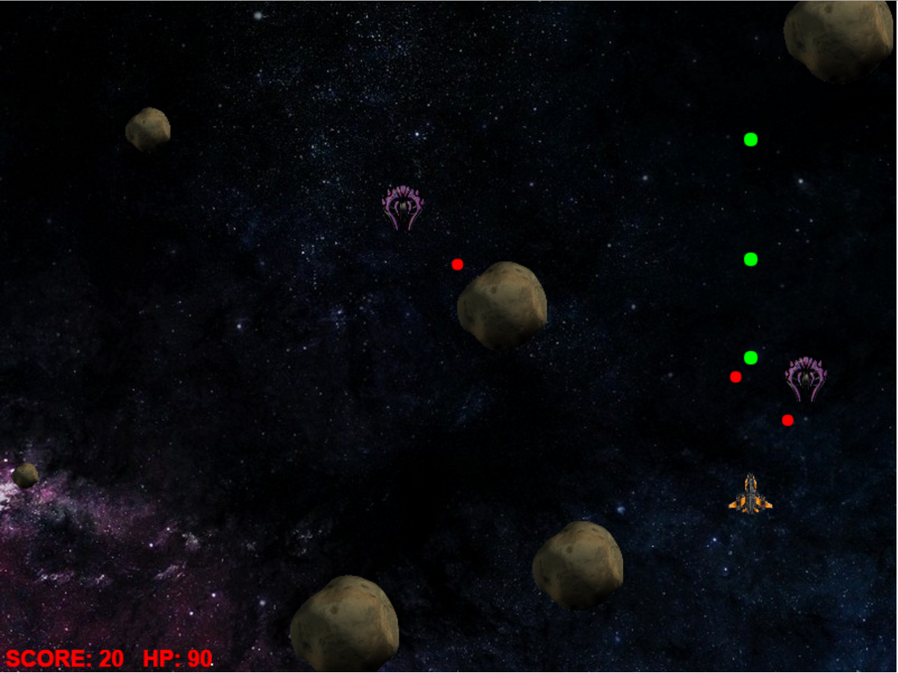

#Gauntlet Run

Welcome to the Gauntlet Run!

--a game by Gilan Salehi --

Race through the asteroid field destroying enemy scouts and cruisers and picking up powerups!  Defeat a horde of enemies and face down the final challenge: the Gauntlet itself.

A few tips:
- [ ] Small asteroids can be destroyed, but larger ones are very tough.  
- [ ] Beware the enemy scouts: they'll avoid asteroids where possible, but they won't hesitate to crash into you!
- [ ] Hold space to fire; don't mash it.
- [ ] You get points from shooting down enemies.  For instance, enemy scouts are 10 points each.
- [ ] Until you level up, you'll have to use fancy flying to trick enemies into crashing or shooting each other.

This project uses Canvas and Javascript.

Coming Soon:
more complex enemies!
missiles and bombs!
leveling up!  

[LinkedIn](www.linkedin.com/in/gilansalehi) ||
[My Site](www.gilansalehi.com) ||
[Play Now!](www.gilansalehi.com/Asteroids2)
